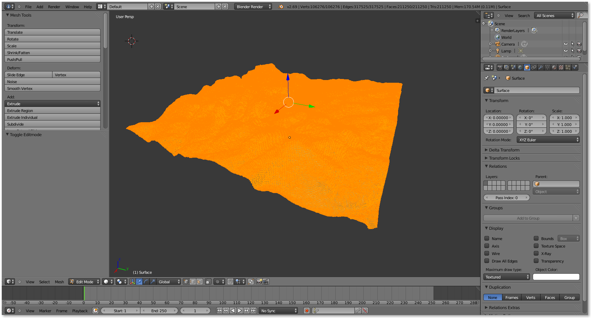
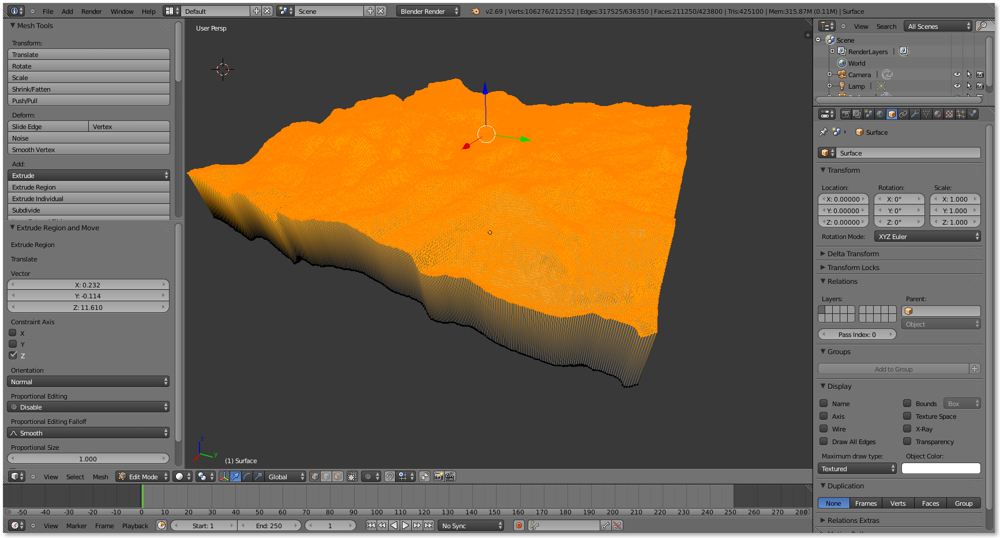
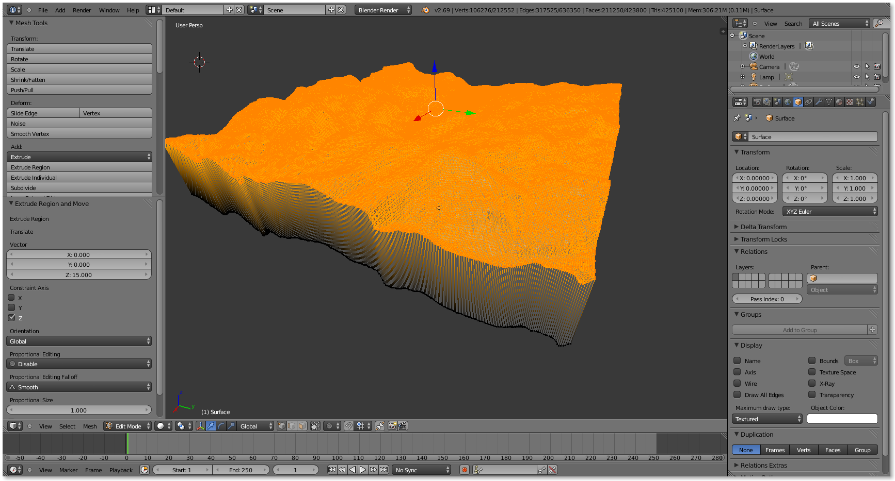
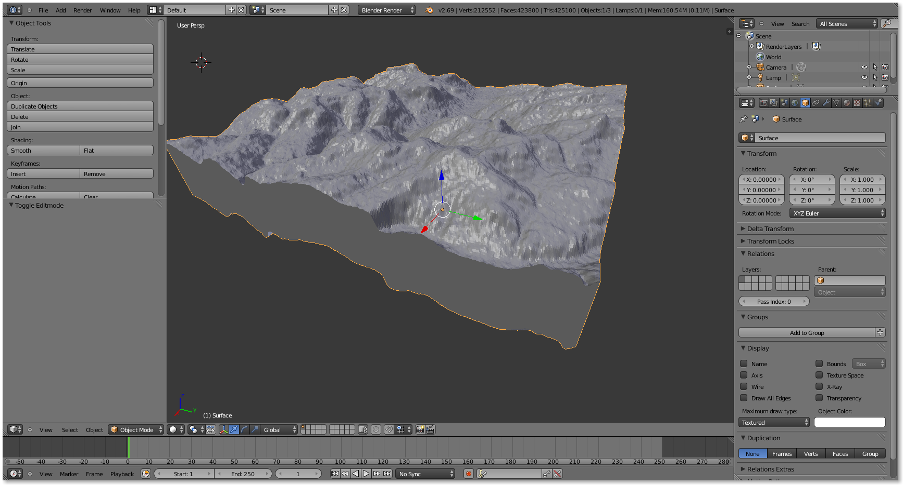
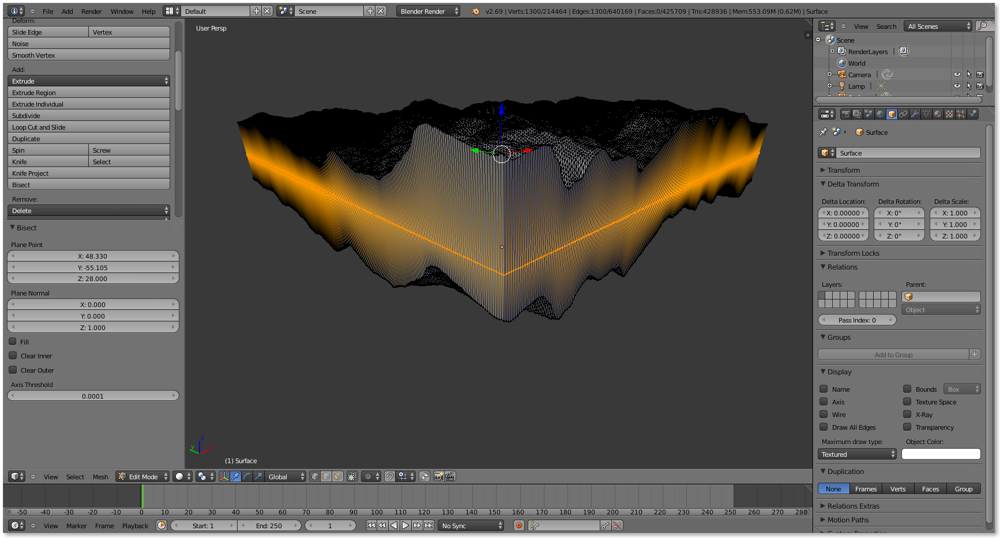
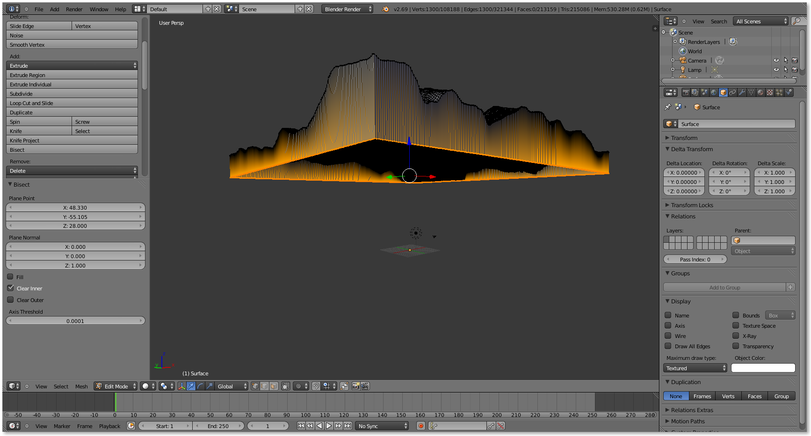

# Extrude a Surface with Blender

How to use Blender's `Extrude` tool to solidify a surface mesh created with `phstl`:

1. 
   Open Blender and import [surface.stl](surface.stl).

2. 
   Press `Tab` to switch to edit mode.
   
3. 
   Select `Extrude Region` from the `Mesh Tools` panel. Drag and click to interactively set initial extrusion. The `Extrude Region and Move` panel should appear.
 
4. 
   Once the `Extrude Region and Move` panel has appeared, adjust the `Extrude Region Translate Vector`. Set the `X` and `Y` values to `0` and the `Z` value to the desired thickness - for instance, `15`. Set `Orientation` to `Global`.

5. 
   Press `Tab` again to exit edit mode. Export the mesh as [surface-extruded.stl](surface-extruded.stl).

# Cut an Extruded Surface

How to use Blender's `Bisect` tool to flatten the base of an extruded surface solid:

1. Beginning with ane extruded surface solid like the one created above, press `Tab` to re-enter edit mode.

2. 
   Select `Bisect` from the `Mesh Tools` panel. Drag and click to interactively set initial cutting plane. Then set the `Plane Normal` to `0, 0, 1` for a horizontal plane and adjust the `Plane Point` `Z` value to intersect the model at the desired elevation.

3. 
   Check `Clear Inner` (or possibly `Clear Outer`, depending on orientation) in the `Bisect` panel to discard part of the bisected object.

4. 
   Check `Fill` in the `Bisect` panel to fill the cut face with a flat surface.
 
5. Press `Tab` again to exit edit mode. Export the mesh as [surface-extruded-bisected.stl](surface-extruded-bisected.stl).
